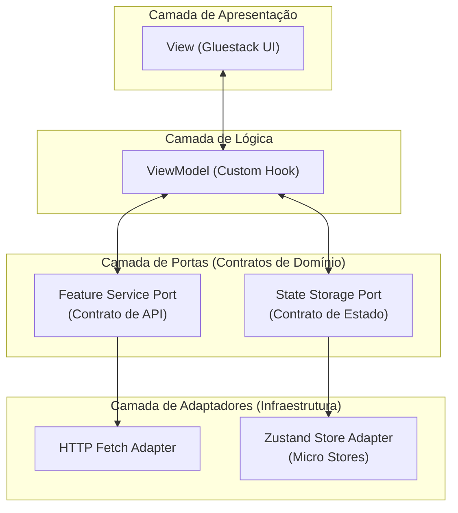

    

# Lumin.AI — React Native mobile App

> Aplicativo Mobile em **React Native e Expo** desenvolvido para potencializar a gestão escolar e o planejamento pedagógico de professores da rede pública de ensino através de **IA Generativa**.

---

## 📋 Índice

- [Sobre o Projeto](#sobre-o-projeto)
- [Stack Tecnológica](#stack-tecnológica)
- [Arquitetura e Padrões](#arquitetura-e-padrões)
- [Estrutura de Pastas](#estrutura-de-pastas)
- [Pré-requisitos e Setup Inicial](#pré-requisitos-e-setup-inicial)
- [Comandos Disponíveis](#comandos-disponíveis)

---

## Sobre o Projeto

O **Lumin.AI** é uma plataforma educacional móvel dessenvolvida para professores da rede pública de ensino brasileira. O aplicativo atua como um assistente de planejamento pedagógico adaptativo alinhado às diretrizes da **BNCC (Base Nacional Comum Curricular)**.

Em vez de atuar como um chatbot conversacional genérico, a inteligência do Lumin.AI opera em **background**, transformando o planejamento de aulasde forma estruturada e dinâmica.

**Inteligência Não-Conversacional Integrada ao Fluxo**: O professor não precisa dominar a engenharia de prompts; a IA reage a controles visuais intuitivos.

### Visão Geral de Uso:

1. **Gestão de Escolas e Turmas**: Organização centralizada do ano letivo por turmas, disciplinas e bimestres.
2. **Geração de Planos de Aula**: Criação automatizada de sequências didáticas adaptadas ao perfil de cada turma.
3. **Recalibração Viva via IA**: Reajuste sob demanda das atividades (tempo, nível de dificuldade, engajamento e inclusão digital) preservando o histórico da aula.

---

## Stack Tecnológica

| Tecnologia                         | Versão                    |
| :--------------------------------- | :------------------------ |
| Expo (Expo Router)                 | ~57.0.7                   |
| React Native                       | 0.86.0                    |
| TypeScript                         | ~6.0.3                    |
| Gluestack UI v5 + NativeWind v5    | ^5.0.15 / 5.0.0-preview.4 |
| Zustand (Micro Stores por Feature) | ^5.0.14                   |

---

## Arquitetura e Padrões

O projeto adota a **Arquitetura Hexagonal (Portas e Adaptadores)** combinada com **MVVM (Model-View-ViewModel)** e **Vertical Slices**:



- **View**: Componentes de UI puros (Gluestack UI + NativeWind), sem lógica de negócio.
- **ViewModel**: Hooks customizados (ex: `useLessonDetailViewModel`) que controlam formulários, chamadas de serviço e estado de tela.
- **Ports (Portas)**: Interfaces TypeScript que definem os contratos dos serviços (`lesson.service.port.ts`, `class.service.port.ts`).
- **Adapters (Adaptadores)**: Implementações concretas que realizam chamadas HTTP via `FetchAdapter` para o backend.

---

## Estrutura de Pastas

```
src/
├── app/                            # Roteamento puro Expo Router (file-based)
│   ├── (home)/
│   ├── class/
│   ├── lesson/
│   ├── _layout.tsx                 # Root layout com Gluestack Provider e fontes
│   └── index.tsx                   # Ponto de entrada e fluxo de Splash / Redirect
│
├── common/                         # Recursos e Contratos Compartilhados Globais
│   └── ports/                      # Interfaces e Contratos das Portas
│
├── components/                     # Sistema de Componentes Visuais
│   ├── ui/                         # Primitivos do Gluestack UI v5 / NativeWind
│   └── *.tsx                       # (Componentes UI Globais: button, header, generic-bottom-sheet, lumin-logo, etc.)
│
├── features/                       # Módulos Funcionais (Vertical Slices)
│   ├── bimester/                   # Feature Bimestre
│   ├── class/                      # Feature Turma
│   ├── home/                       # Feature Home
│   ├── lesson/                     # Feature Aula
│   ├── school/                     # Feature Escola
│   └── splash/                     # Feature SplashScreen
│
└── infra/                          # Adaptadores Concretos (Infraestrutura)
    ├── http/                       # Adaptador HTTP Fetch (fetch.adapter.ts)
    ├── initialization/             # Adaptadores de Inicialização (HTTP vs Simulator)
    └── store/                      # Adaptadores de Estado Zustand (bimester, class, lesson, school)
```

---

## Pré-requisitos e Setup Inicial

### 📌 Pré-requisitos:

- **Node.js**: `v24` (ou versão LTS recente `^20.x`)
- **Package Manager**: **pnpm** (obrigatório conforme diretrizes do projeto)
- **Expo Go / Simulador**: iOS Simulator ou Android Emulator
- **Dependência do Backend**: O aplicativo mobile conecta-se à API REST exposta pelo serviço [`lumin-ai-backend`](https://github.com/gfpaiva/lumin-ai-backend), que deve estar em execução para que a integração com o banco de dados e com a IA Generativa funcione corretamente.

### 🚀 Setup Inicial

1. **Clonar o repositório:**

   ```bash
   git clone https://github.com/gfpaiva/lumin-ai-app.git
   cd lumin-ai-app
   ```

2. **Instalar dependências:**

   ```bash
   pnpm install
   ```

3. **Configurar Variáveis de Ambiente:**
   Crie um arquivo `.env` na raiz informando a URL do backend:

   ```env
   EXPO_PUBLIC_API_URL=http://localhost:3000
   ```

4. **Iniciar o aplicativo:**
   ```bash
   pnpm start
   ```

---

## Comandos Disponíveis

| Comando        | Descrição                                              |
| :------------- | :----------------------------------------------------- |
| `pnpm start`   | Inicia o servidor de desenvolvimento do Expo.          |
| `pnpm android` | Executa o aplicativo no emulador Android.              |
| `pnpm ios`     | Executa o aplicativo no simulador iOS.                 |
| `pnpm lint`    | Executa o linter para checagem de qualidade do código. |

---

<p align="center">Desenvolvido com 💙 por Guilherme Paiva.</p>
